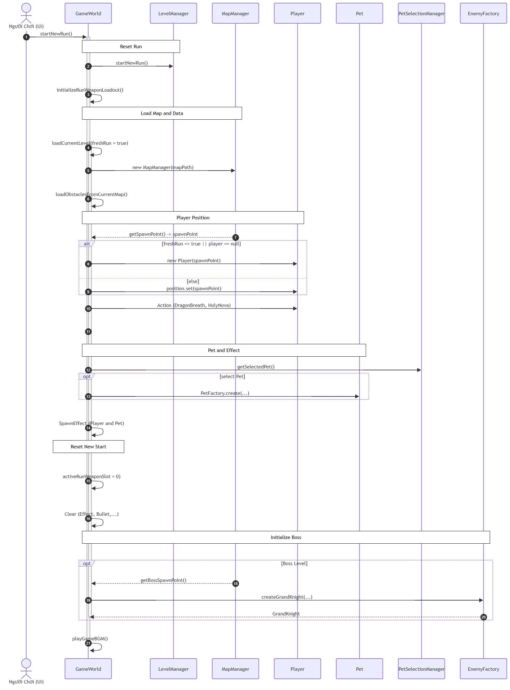
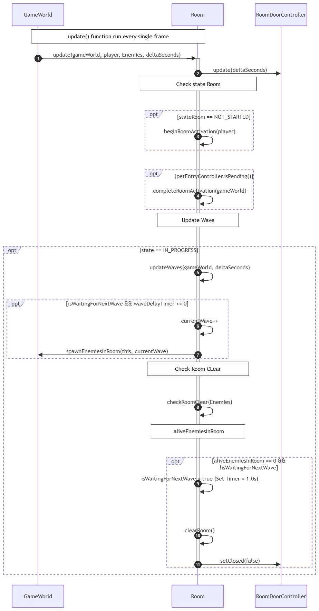

# Soul Knight
Game nhập vai hành động 2D lấy cảm hứng từ Soul Knight, xây dựng bằng JavaFX. 
Được phát triển bởi nhóm sinh viên: 
Nguyễn Mạnh Cường 
Vũ Việt Dũng 
Và HVCH Trần Minh Tuấn Kiệt 
## Tính năng nổi bật
* Hệ thống Map và Room: Hệ thống map được xây dựng bằng các file json dựa trên 
công cụ Title , được phân chia thành các phòng vơi các chức năng khác nhau trên một màn chơi.
* Hệ thống quái : được điều khiển tự động với khả năng ẩn nấp dò đường thông minh để tìm mục tiêu.
* Hệ thống các vũ khí: các vuc khí tối tân được trang bị để cho player đanhs quái
với 3 loại chính: súng , vũ khí cận chiến và vũ khí nạp năng lượng.
* Hệ thống Buff: trợ giúp người chơi vượt qua các Room một cách dễ dàng nhờ các tính năng ưu việt
* Trận Boss: Phòng đấu khó nhằn nhất trong cuộc chơi vơi hiệu ứng hình ảnh ânh thanh đẹp mắt
* Hệ thống UFO: Cứu tinh của lũ quái triệu hồi cac debuff trap gây trở ngại cho người chơi
và triệu hôif viện binh khi quái trong phong gặp khó khăn với xác suất 75%
* Hệ thống Shop:Người chơi có thể dùng xu kiếm được từ màn chơi để trang bị các vật phẩm(
lựa chọn nhân vật mình thích, pet đồng hành , bổ sung vũ khí và các buff)
* Hệ thống cơ sở dữ liệu: Cho phép lưu trữ thông tin người chơi , phòng màn , trang bị
đã mua trong shop, và bảng điểm cao leaderbroad
* Hệ thôgns cốt truyện:mang hơi hướng cinematic gợi cảm giác tò mò
* 

##  Yêu cầu hệ thống
* **Java Development Kit (JDK):** Version 17 hoặc cao hơn.
* **JavaFX SDK:** Version 17 trở lên.
* **Build Tool:** Maven hoặc Gradle.

##  Hướng dẫn chơi game
Điều khiển  player bằng WASH hoặc  các mũi tên 
Dùng chuột để ngắm bắn và tương tác sự kiện trên màn hình 
Dùng phím M để tắt tiếng , ESC để pause game 
Ngoài ra có thêm chế độ rảnh tay điều khiển game bằng touch pad và
tự động ngắm bắn.

## Sơ đồ Cấu trúc Package và Class

    namespace com_soulknight_cinematic {
        class CinematicPlayer
        class CinematicScene
        class VisualNovelScene
    }

    namespace com_soulknight_database {
        class DatabaseConfig
        class DatabaseInitializer
        class DatabaseManager
        class EquipmentLoader
        class LeaderboardEntry
        class PasswordHasher
        class PlayerSave
        class PlayerSaveDAO
        class PlayerSaveMapper
        class ShopDAO
        class UserAccount
        class UserDAO
        class UserSession
    }

    namespace com_soulknight_debuff {
        class DebuffItem
        class DebuffSpawner
        class DebuffType
        class PlayerDebuffManager
    }

    namespace com_soulknight_debuff_render {
        class ConfusionVisualEffect
        class DebuffVisualEffect
        class FreezeVisualEffect
        class PoisonVisualEffect
        class SlowVisualEffect
        class WeaknessVisualEffect
    }

    namespace com_soulknight_engine {
        class Camera
        class DynamicBackground
        class GameLoop
        class GameState
        class GameWorld
        class InputHandler
        class RewardPicker
        class TouchpadJoystick
    }

    namespace com_soulknight_entity {
        class Boss
        class BossAnimator
        class Enemy
        class EnemyAnimator
        class EnemyArchetype
        class EnemyFactory
        class Entity
        class HeroSelectionManager
        class HeroType
        class Player
        class PlayerAnimator
        class ScratchMark
        class Shockwave
        class UFOEvent
    }

    namespace com_soulknight_event {
        class GameEventListener
    }

    namespace com_soulknight_item {
        class BuffItem
        class EnergyCrystal
        class GemItem
        class GoldItem
        class Item
        class ItemMagnetSystem
    }

    namespace com_soulknight_level {
        class LevelManager
    }

    namespace com_soulknight_map {
        class MapManager
        class NeonEnvironmentManager
        class Obstacle
        class RestRoomController
        class RestShrine
        class Room
        class RoomDoorController
        class Tile
    }

    namespace com_soulknight_map_json {
        class LayerData
        class ObjectData
        class PropertyData
        class TiledMapData
    }

    namespace com_soulknight_mission {
        class BossDefeatMission
        class CollectItemMission
        class KillTargetMission
        class Mission
        class MissionManager
    }

    namespace com_soulknight_model {
        class StoryConfigLoader
        class StoryFrame
    }

    namespace com_soulknight_pet {
        class Pet
        class PetFactory
        class PetRoomEntryController
        class PetRoomInfo
        class PetRoomPlacementService
        class PetSelectionManager
        class PetType
    }

    namespace com_soulknight_ui {
        class AccountController
        class BossIntroController
        class CatLoadingOverlay
        class DeveloperRoomBackground
        class GameOverScreen
        class HUD
        class IntroController
        class IntroToLoginTransition
        class LeaderboardController
        class LevelClearScreen
        class LoginController
        class MainMenuRealityBreachBackground
        class Menu
        class MinimapRenderer
        class PauseScreen
        class PortalOverlay
        class RegisterController
        class SettingScreen
        class ShopController
        class StoryEndingController
        class StoryIntroController
        class UIManager
        class VictoryScreen
    }

    namespace com_soulknight_utils {
        class Constants
        class DatabaseExecutor
        class ResourceLoader
        class SoundManager
        class Vector2D
    }

    namespace com_soulknight_weapon {
        class Bullet
        class ExplosionEffect
        class Gun
        class IonElectromagneticGun
        class Melee
        class PrototypeRailgun
        class SlashEffect
        class SoundWaveEffect
        class Weapon
        class WeaponSelectionManager
        class WeaponType
    }

    namespace com_soulknight_weapon_render {
        class IonChargeRenderer
        class IonExplosionEffect
        class IonProjectileRenderer
        class ProjectileRenderer
    }

## Một số sequence diagram của game 
Init game sequence diagrame

Player come to room sequence diagrame

